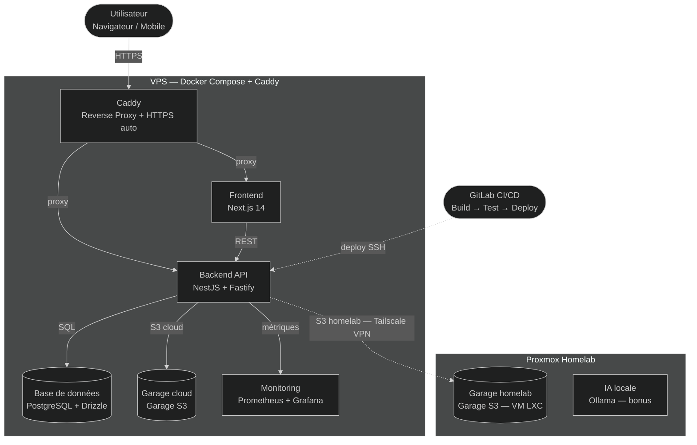

```mermaid
%%{init: {'theme': 'dark', 'themeVariables': {'fontSize': '16px'}}}%%
flowchart TD
  U(["Utilisateur\nNavigateur / Mobile"])
  GL(["GitLab CI/CD\nBuild → Test → Deploy"])

  subgraph VPS ["VPS — Docker Compose + Caddy"]
    CA["Caddy\nReverse Proxy + HTTPS auto"]
    FE["Frontend\nNext.js 14"]
    BE["Backend API\nNestJS + Fastify"]
    DB[("Base de données\nPostgreSQL + Drizzle")]
    GC[("Garage cloud\nGarage S3")]
    MO["Monitoring\nPrometheus + Grafana"]
  end

  subgraph HL ["Proxmox Homelab"]
    GH[("Garage homelab\nGarage S3 — VM LXC")]
    IA["IA locale\nOllama — bonus"]
  end

  U -->|HTTPS| CA
  CA -->|proxy| FE
  CA -->|proxy| BE
  FE -->|REST| BE
  BE -->|SQL| DB
  BE -->|S3 cloud| GC
  BE -->|métriques| MO
  BE -.->|S3 homelab — Tailscale VPN| GH
  GL -.->|deploy SSH| BE
```