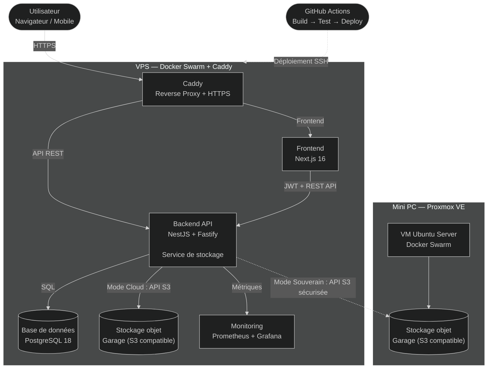

```mermaid
%%{init: {'theme': 'dark', 'themeVariables': {'fontSize': '16px'}}}%%
flowchart TD

    U(["Utilisateur<br/>Navigateur / Mobile"])
    GL(["GitHub Actions<br/>Build → Test → Deploy"])

    subgraph VPS ["VPS — Docker Swarm + Caddy"]

        CA["Caddy<br/>Reverse Proxy + HTTPS"]

        FE["Frontend<br/>Next.js 16"]

        BE["Backend API<br/>NestJS + Fastify<br/><br/>Service de stockage"]

        DB[("Base de données<br/>PostgreSQL 18")]

        GC[("Stockage objet<br/>Garage (S3 compatible)")]

        MO["Monitoring<br/>Prometheus + Grafana"]

    end

    subgraph HOME ["Mini PC — Proxmox VE"]

        VM["VM Ubuntu Server<br/>Docker Swarm"]

        GH[("Stockage objet<br/>Garage (S3 compatible)")]

        VM --> GH

    end

    U -->|HTTPS| CA

    CA -->|Frontend| FE
    CA -->|API REST| BE

    FE -->|JWT + REST API| BE

    BE -->|SQL| DB

    BE -->|Mode Cloud : API S3| GC

    BE -.->|Mode Souverain : API S3 sécurisée| GH

    BE -->|Métriques| MO

    GL -.->|Déploiement SSH| VPS
```