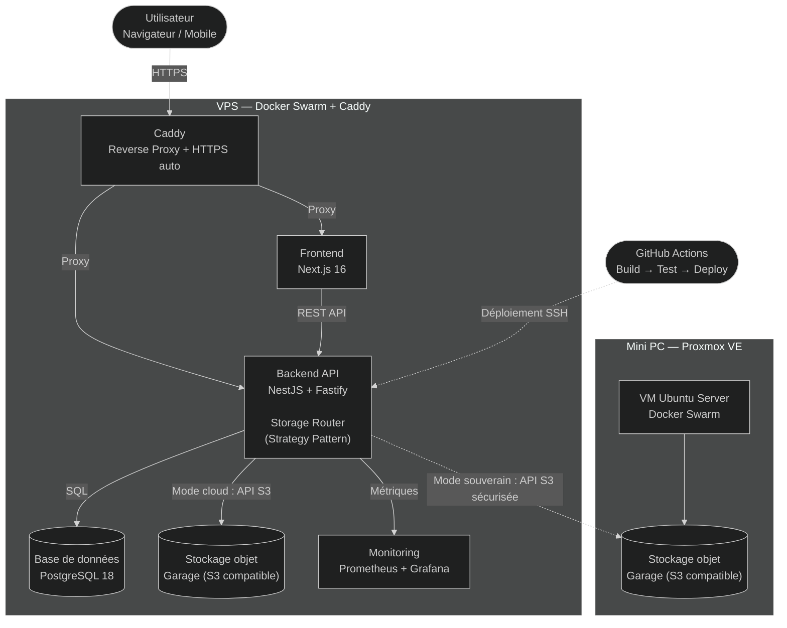

```mermaid
%%{init: {'theme': 'dark', 'themeVariables': {'fontSize': '16px'}}}%%
flowchart TD

  U(["Utilisateur\nNavigateur / Mobile"])
  GL(["GitHub Actions\nBuild → Test → Deploy"])

  subgraph VPS ["VPS — Docker Swarm + Caddy"]

    CA["Caddy\nReverse Proxy + HTTPS auto"]

    FE["Frontend\nNext.js 16"]

    BE["Backend API\nNestJS + Fastify\n\nStorage Router\n(Strategy Pattern)"]

    DB[("Base de données\nPostgreSQL 18")]

    GC[("Stockage objet\nGarage (S3 compatible)")]

    MO["Monitoring\nPrometheus + Grafana"]

  end

  subgraph HL ["Mini PC — Proxmox VE"]

    UB["VM Ubuntu Server\nDocker Swarm"]

    GH[("Stockage objet\nGarage (S3 compatible)")]

    UB --> GH

  end

  U -->|HTTPS| CA

  CA -->|Proxy| FE
  CA -->|Proxy| BE

  FE -->|REST API| BE

  BE -->|SQL| DB

  BE -->|Mode cloud : API S3| GC

  BE -.->|Mode souverain : API S3 sécurisée| GH

  BE -->|Métriques| MO

  GL -.->|Déploiement SSH| BE
```