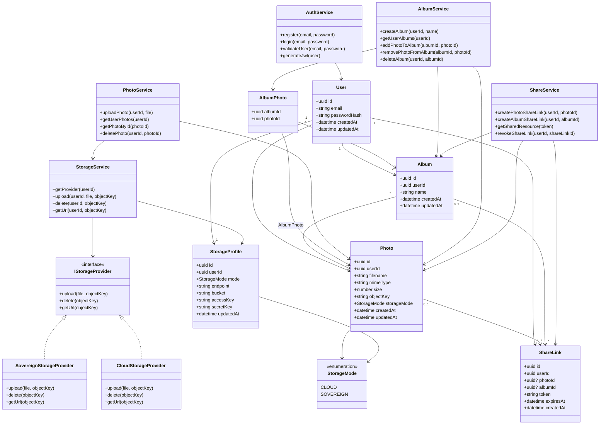

# Diagramme de classes — Sovlens

## Objectif

Ce diagramme présente l'architecture backend métier de Sovlens.

Il modélise les principales entités manipulées par l'application, les services associés et le **Strategy Pattern** utilisé pour basculer entre deux modes de stockage :

- stockage cloud classique ;
- stockage souverain auto-hébergé.

Les technologies comme Next.js, NestJS, Drizzle ORM, Drizzle Zod, PostgreSQL, Garage, Docker Swarm ou Caddy ne sont pas représentées ici comme des classes. Elles sont documentées dans les documents d'architecture, les choix techniques et le modèle de données.

## Diagramme

## Explications

### Utilisateur

`User` représente un utilisateur de l'application.

Un utilisateur peut :

- posséder plusieurs photos ;
- créer plusieurs albums ;
- générer plusieurs liens de partage ;
- posséder un profil de stockage.

### Photos

`Photo` représente les métadonnées d'une photo.

Le fichier réel n'est pas stocké directement dans la base relationnelle. La classe conserve uniquement les informations nécessaires pour retrouver l'objet stocké :

- nom du fichier ;
- type MIME ;
- taille ;
- clé de stockage ;
- mode de stockage utilisé.

### Albums

`Album` permet à l'utilisateur d'organiser ses photos.

La relation entre `Album` et `Photo` est une relation plusieurs-à-plusieurs. Elle est représentée par la classe d'association `AlbumPhoto`.

### Partage

`ShareLink` permet de partager publiquement une photo ou un album.

Un lien de partage contient :

- un token unique ;
- une ressource ciblée, photo ou album ;
- une date d'expiration optionnelle ;
- une date de création.

Les champs `photoId` et `albumId` sont optionnels car un lien de partage cible soit une photo, soit un album.

### Profil de stockage

`StorageProfile` représente les préférences de stockage d'un utilisateur.

Il permet de définir le mode de stockage actif :

- `CLOUD` : stockage cloud classique ;
- `SOVEREIGN` : stockage souverain auto-hébergé.

Le mode souverain correspond au cas où l'utilisateur utilise son propre stockage compatible S3, par exemple un service auto-hébergé sur un homelab.

### Services métier

Les services représentent la logique applicative du backend.

- `AuthService` gère l'inscription, la connexion et la génération du JWT.
- `PhotoService` gère l'upload, la récupération et la suppression des photos.
- `AlbumService` gère les albums et l'association des photos.
- `ShareService` gère la création et la révocation des liens de partage.
- `StorageService` orchestre l'accès au stockage objet.

### Strategy Pattern

Le stockage utilise le **Strategy Pattern**.

L'interface `IStorageProvider` définit un contrat commun pour tous les modes de stockage :

- `upload`
- `delete`
- `getUrl`

Deux implémentations concrètes existent :

- `CloudStorageProvider` : stockage cloud classique ;
- `SovereignStorageProvider` : stockage souverain auto-hébergé.

`StorageService` sélectionne dynamiquement l'implémentation adaptée selon le `StorageProfile` de l'utilisateur.

Ce découpage permet d'ajouter un nouveau mode de stockage sans modifier la logique métier principale.