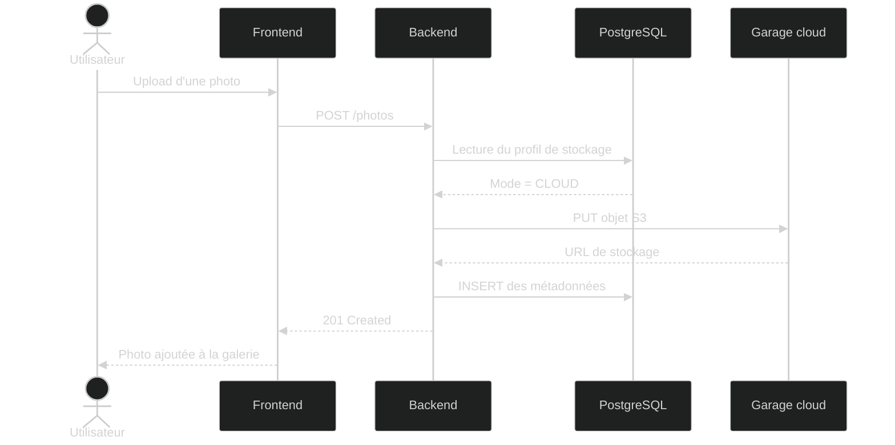
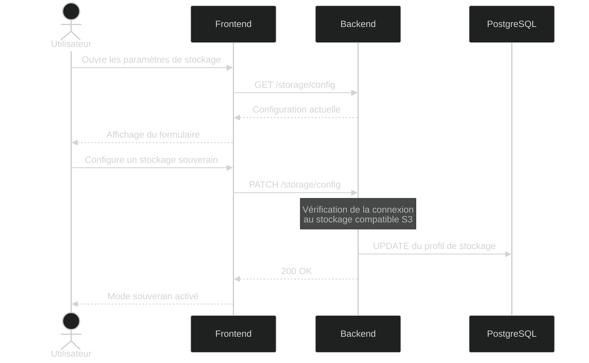
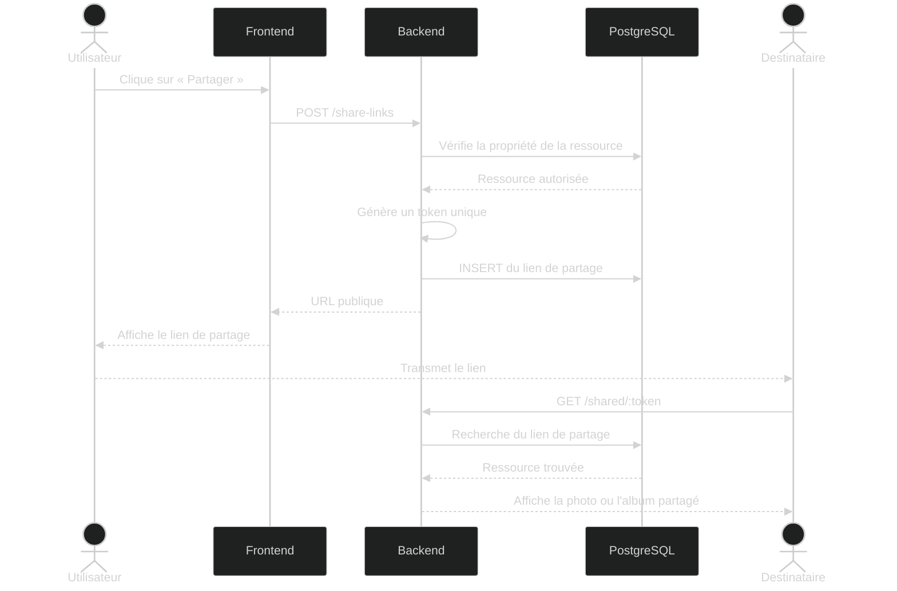

# Diagrammes de séquence

## Objectif

Ces diagrammes illustrent les principaux flux d'interaction entre le frontend, le backend, la base de données et les services de stockage de Sovlens.

Ils présentent le fonctionnement de la Killer Feature du projet ainsi que les principaux échanges entre les différents composants de l'application.

Les scénarios couverts sont :

- upload d'une photo en mode cloud ;
- activation du mode de stockage souverain ;
- upload d'une photo en mode souverain ;
- partage public d'une photo ou d'un album.

---

## Scénario 1 — Upload en mode cloud (par défaut)

---

## Scénario 2 — Activation du mode souverain

---

## Scénario 3 — Upload en mode souverain

---

## Scénario 4 — Partage d'une photo ou d'un album

## Conclusion

Ces diagrammes présentent les principaux flux fonctionnels de Sovlens : l'upload d'une photo, l'activation du mode de stockage souverain, le stockage des fichiers selon le mode choisi et le partage public de photos ou d'albums.

Ils montrent que le frontend interagit toujours avec la même API REST. Le backend se charge ensuite de sélectionner le fournisseur de stockage approprié et de gérer les traitements métier, garantissant une expérience utilisateur identique quel que soit le mode de stockage retenu.