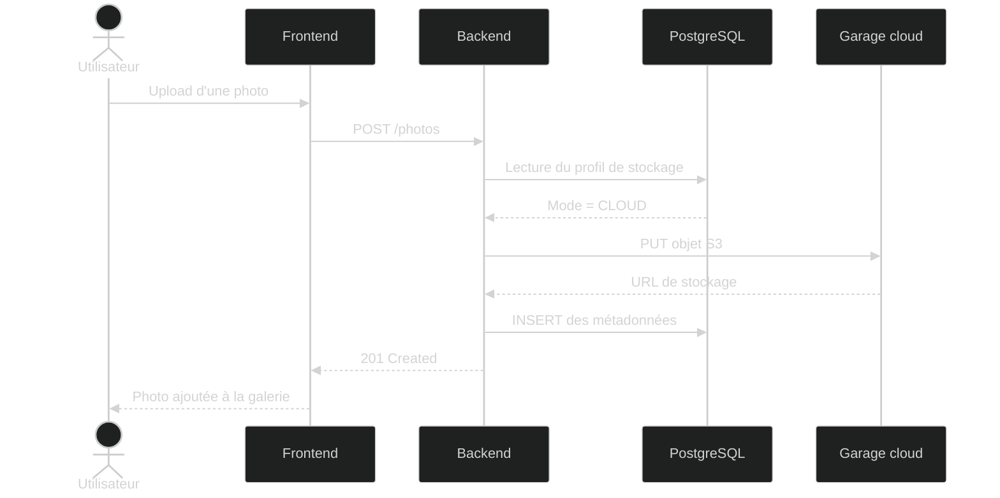
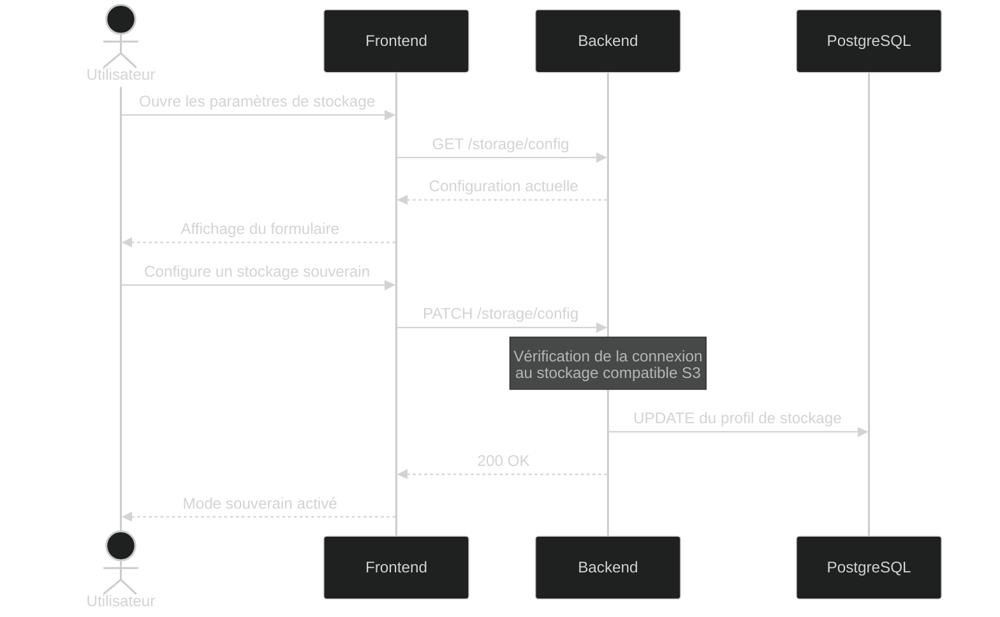

# Diagrammes de séquence

## Objectif

Ces diagrammes illustrent les principaux flux d'interaction entre le frontend, le backend, la base de données et les services de stockage de Sovlens.

Ils présentent le fonctionnement de la Killer Feature du projet ainsi que les principaux échanges entre les différents composants de l'application.

Les scénarios couverts sont :

- upload d'une photo en mode cloud ;
- activation du mode de stockage souverain ;
- upload d'une photo en mode souverain.

---

## Scénario 1 — Upload en mode cloud (par défaut)

---

## Scénario 2 — Activation du mode souverain

---

## Scénario 3 — Upload en mode souverain

## Conclusion

Ces trois diagrammes mettent en évidence le fonctionnement de la Killer Feature de Sovlens. Quelle que soit la destination de stockage choisie (cloud ou souveraine), le frontend utilise la même API REST. Le backend sélectionne dynamiquement le fournisseur de stockage approprié avant d'enregistrer les métadonnées dans PostgreSQL.

Cette architecture garantit une expérience utilisateur identique tout en laissant à chaque utilisateur le choix de l'emplacement de stockage de ses photos.