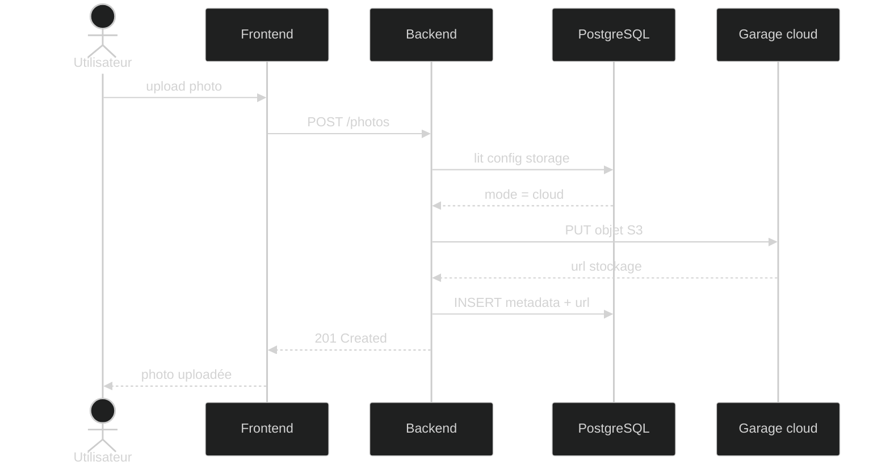
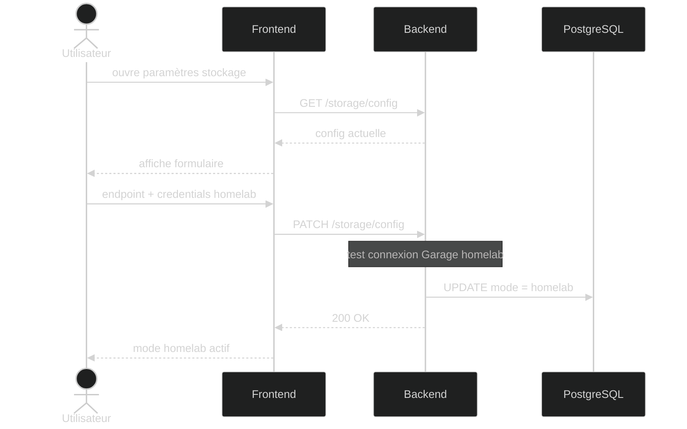
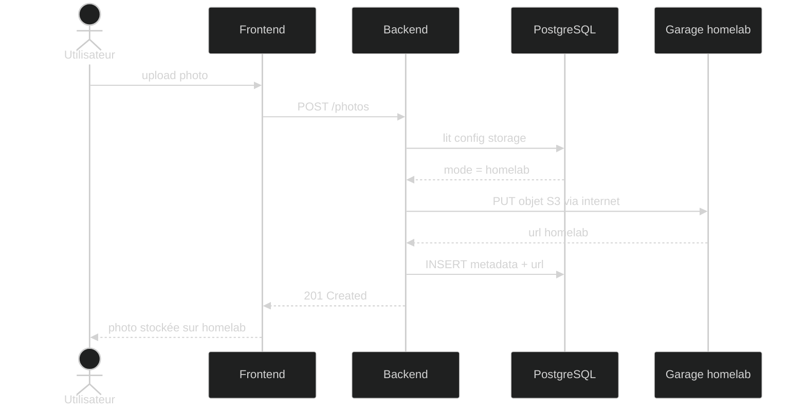

# Diagramme de séquence — Killer Feature

## Scénario 1 — Upload mode cloud (défaut)

```mermaid
%%{init: {'theme': 'dark', 'themeVariables': {'fontSize': '16px'}}}%%
sequenceDiagram
  actor U as Utilisateur
  participant F as Frontend
  participant B as Backend
  participant DB as PostgreSQL
  participant GC as Garage cloud

  U->>F: upload photo
  F->>B: POST /photos
  B->>DB: lit config storage
  DB-->>B: mode = cloud
  B->>GC: PUT objet S3
  GC-->>B: url stockage
  B->>DB: INSERT metadata + url
  B-->>F: 201 Created
  F-->>U: photo uploadée
```

## Scénario 2 — Activation mode expert (homelab)

```mermaid
%%{init: {'theme': 'dark', 'themeVariables': {'fontSize': '16px'}}}%%
sequenceDiagram
  actor U as Utilisateur
  participant F as Frontend
  participant B as Backend
  participant DB as PostgreSQL

  U->>F: ouvre paramètres stockage
  F->>B: GET /storage/config
  B-->>F: config actuelle
  F-->>U: affiche formulaire
  U->>F: endpoint + credentials homelab
  F->>B: PATCH /storage/config
  Note over B: test connexion Garage homelab
  B->>DB: UPDATE mode = homelab
  B-->>F: 200 OK
  F-->>U: mode homelab actif
```

## Scénario 3 — Upload mode homelab (souverain)

```mermaid
%%{init: {'theme': 'dark', 'themeVariables': {'fontSize': '16px'}}}%%
sequenceDiagram
  actor U as Utilisateur
  participant F as Frontend
  participant B as Backend
  participant DB as PostgreSQL
  participant GH as Garage homelab

  U->>F: upload photo
  F->>B: POST /photos
  B->>DB: lit config storage
  DB-->>B: mode = homelab
  B->>GH: PUT objet S3 via internet
  GH-->>B: url homelab
  B->>DB: INSERT metadata + url
  B-->>F: 201 Created
  F-->>U: photo stockée sur homelab
```