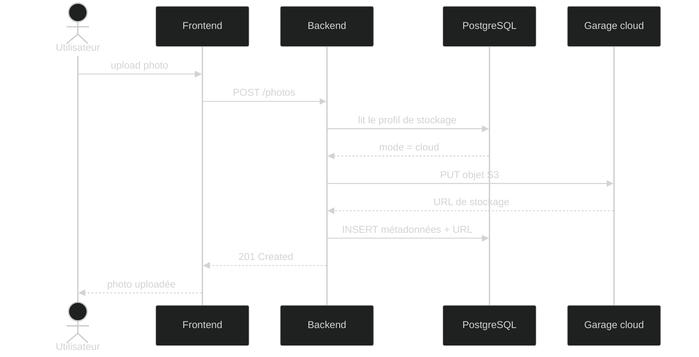
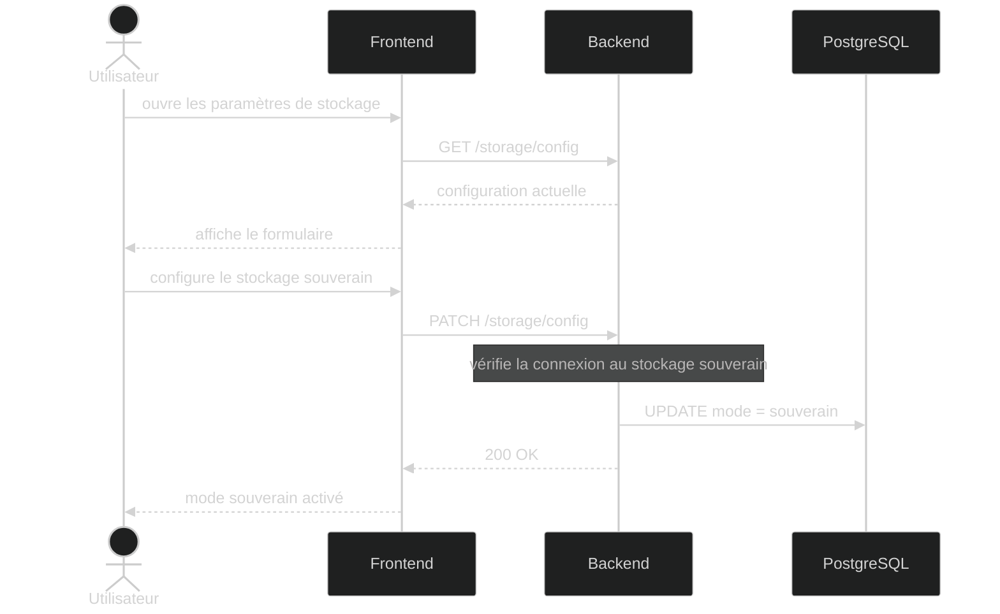
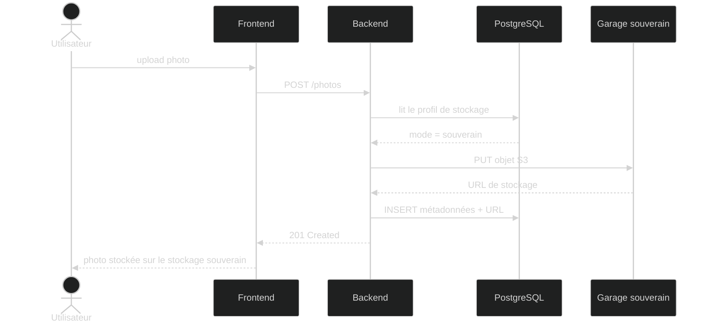

# Diagramme de séquence — Killer Feature

## Scénario 1 — Upload en mode cloud (par défaut)

```mermaid
%%{init: {'theme': 'dark', 'themeVariables': {'fontSize': '16px'}}}%%
sequenceDiagram
  actor U as Utilisateur
  participant F as Frontend
  participant B as Backend
  participant DB as PostgreSQL
  participant GC as Garage cloud

  U->>F: upload photo
  F->>B: POST /photos
  B->>DB: lit le profil de stockage
  DB-->>B: mode = cloud
  B->>GC: PUT objet S3
  GC-->>B: URL de stockage
  B->>DB: INSERT métadonnées + URL
  B-->>F: 201 Created
  F-->>U: photo uploadée
```

---

## Scénario 2 — Activation du mode souverain

```mermaid
%%{init: {'theme': 'dark', 'themeVariables': {'fontSize': '16px'}}}%%
sequenceDiagram
  actor U as Utilisateur
  participant F as Frontend
  participant B as Backend
  participant DB as PostgreSQL

  U->>F: ouvre les paramètres de stockage
  F->>B: GET /storage/config
  B-->>F: configuration actuelle
  F-->>U: affiche le formulaire
  U->>F: configure le stockage souverain
  F->>B: PATCH /storage/config
  Note over B: vérifie la connexion au stockage souverain
  B->>DB: UPDATE mode = souverain
  B-->>F: 200 OK
  F-->>U: mode souverain activé
```

---

## Scénario 3 — Upload en mode souverain

```mermaid
%%{init: {'theme': 'dark', 'themeVariables': {'fontSize': '16px'}}}%%
sequenceDiagram
  actor U as Utilisateur
  participant F as Frontend
  participant B as Backend
  participant DB as PostgreSQL
  participant GS as Garage souverain

  U->>F: upload photo
  F->>B: POST /photos
  B->>DB: lit le profil de stockage
  DB-->>B: mode = souverain
  B->>GS: PUT objet S3
  GS-->>B: URL de stockage
  B->>DB: INSERT métadonnées + URL
  B-->>F: 201 Created
  F-->>U: photo stockée sur le stockage souverain
```