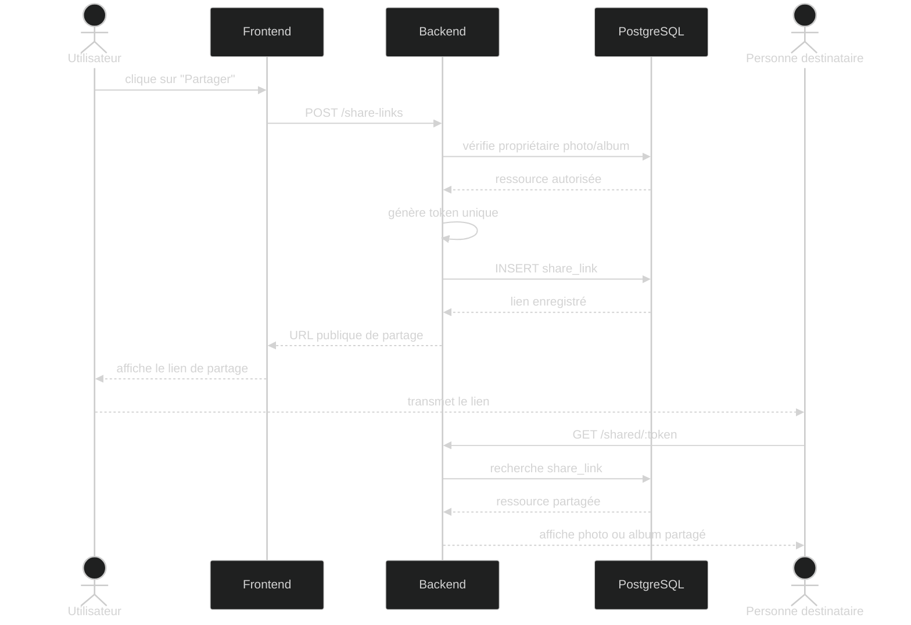

# Diagramme de séquence — Partage d'une photo ou d'un album

## Objectif

Ce diagramme décrit le partage public d'une photo ou d'un album par un utilisateur authentifié.

Le backend vérifie que l'utilisateur est propriétaire de la ressource, génère un token de partage, enregistre le lien puis renvoie une URL publique au frontend.

## Diagramme

## Description

1. L'utilisateur clique sur l'action de partage depuis une photo ou un album.
2. Le frontend envoie une demande de création de lien public au backend.
3. Le backend vérifie que l'utilisateur est bien propriétaire de la ressource.
4. Le backend génère un token unique.
5. Le lien de partage est enregistré en base de données.
6. Le frontend affiche l'URL publique générée.
7. L'utilisateur transmet ce lien à une autre personne.
8. La personne destinataire accède à la ressource partagée via le token.

## Remarque

Le lien public ne donne pas accès au compte utilisateur complet.  
Il permet uniquement d'accéder à la ressource explicitement partagée.