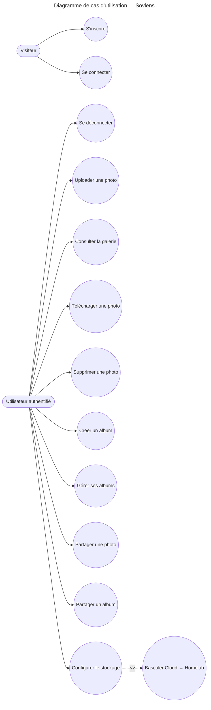

# Diagramme de cas d'utilisation — Sovlens

## Objectif

Ce diagramme présente les principaux acteurs de l'application Sovlens ainsi que les fonctionnalités qui leur sont accessibles.

## Acteurs

- **Visiteur** : utilisateur non authentifié.
- **Utilisateur authentifié** : utilisateur connecté à son espace personnel.

## Diagramme

## Description des cas d'utilisation

| Cas d'utilisation | Acteur | Description |
|-------------------|---------|-------------|
| S'inscrire | Visiteur | Création d'un nouveau compte utilisateur. |
| Se connecter | Visiteur | Authentification sur la plateforme. |
| Se déconnecter | Utilisateur authentifié | Fermeture de la session utilisateur. |
| Uploader une photo | Utilisateur authentifié | Ajout d'une photo dans l'espace personnel. |
| Consulter la galerie | Utilisateur authentifié | Affichage de l'ensemble des photos. |
| Télécharger une photo | Utilisateur authentifié | Téléchargement d'une photo stockée. |
| Supprimer une photo | Utilisateur authentifié | Suppression d'une photo. |
| Créer un album | Utilisateur authentifié | Création d'un nouvel album. |
| Gérer ses albums | Utilisateur authentifié | Modification ou suppression d'un album. |
| Partager une photo | Utilisateur authentifié | Génération d'un lien de partage public. |
| Partager un album | Utilisateur authentifié | Partage d'un album complet. |
| Configurer le stockage | Utilisateur authentifié | Paramétrage du mode de stockage. |
| Basculer Cloud ↔ Homelab | Utilisateur authentifié | Activation de la Killer Feature permettant de choisir entre un stockage cloud hébergé et un stockage souverain compatible S3. |

## Remarques

La fonctionnalité **Basculer Cloud ↔ Homelab** constitue la Killer Feature de Sovlens. Elle permet à l'utilisateur de choisir dynamiquement l'emplacement de stockage de ses photos entre une infrastructure cloud et son propre serveur personnel utilisant un stockage objet compatible S3.