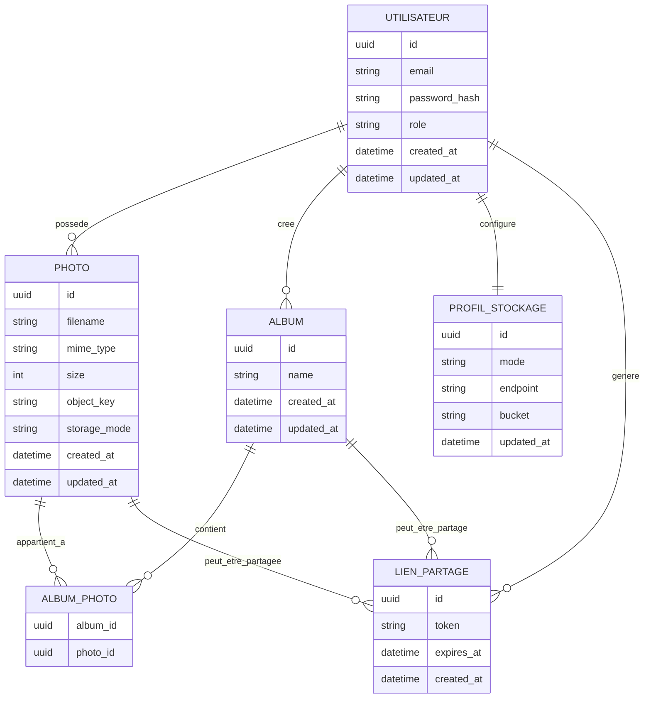

# MCD — Modèle Conceptuel de Données

## Objectif

Ce document présente le modèle conceptuel de données de Sovlens.

Il décrit les principales entités métier de l'application, leurs attributs importants et les relations entre elles.

Le MCD reste indépendant des choix techniques d'implémentation. Il ne représente donc pas Drizzle, NestJS, Garage ou PostgreSQL comme des entités métier.

## Entités principales

- Utilisateur
- Photo
- Album
- Lien de partage
- Profil de stockage

## Diagramme

## Description des entités

### Utilisateur

L'entité `Utilisateur` représente une personne possédant un compte sur Sovlens.

Elle permet de gérer :

- l'identité du compte ;
- l'authentification ;
- le rôle de l'utilisateur ;
- les photos, albums et liens de partage associés.

### Photo

L'entité `Photo` représente une image ajoutée par un utilisateur.

Elle ne contient pas le fichier binaire de la photo.  
Elle stocke uniquement les métadonnées nécessaires à sa gestion :

- nom du fichier ;
- type MIME ;
- taille ;
- clé de stockage objet ;
- mode de stockage utilisé.

### Album

L'entité `Album` permet de regrouper plusieurs photos.

Un utilisateur peut créer plusieurs albums.  
Une photo peut appartenir à plusieurs albums.

Cette relation plusieurs-à-plusieurs est représentée par l'entité d'association `Album_Photo`.

### Album_Photo

L'entité `Album_Photo` représente l'association entre un album et une photo.

Elle permet de modéliser la relation plusieurs-à-plusieurs entre les albums et les photos.

### Lien de partage

L'entité `Lien_Partage` permet de partager publiquement une photo ou un album.

Un lien de partage contient :

- un token unique ;
- une date de création ;
- une date d'expiration optionnelle.

Un lien peut cibler soit une photo, soit un album.

### Profil de stockage

L'entité `Profil_Stockage` représente le mode de stockage choisi par l'utilisateur.

Deux modes sont prévus :

- `cloud` : stockage objet hébergé sur l'infrastructure cloud de Sovlens ;
- `souverain` : stockage objet hébergé sur une infrastructure souveraine compatible S3.

Ce profil permet au backend de déterminer où stocker les fichiers de l'utilisateur.

## Cardinalités

| Relation | Cardinalité | Description |
|---|---:|---|
| Utilisateur — Photo | 1,n | Un utilisateur peut posséder plusieurs photos. Une photo appartient à un seul utilisateur. |
| Utilisateur — Album | 1,n | Un utilisateur peut créer plusieurs albums. Un album appartient à un seul utilisateur. |
| Utilisateur — Profil_Stockage | 1,1 | Un utilisateur possède un seul profil de stockage actif. |
| Album — Photo | n,n | Un album peut contenir plusieurs photos. Une photo peut appartenir à plusieurs albums. |
| Utilisateur — Lien_Partage | 1,n | Un utilisateur peut générer plusieurs liens de partage. |
| Photo — Lien_Partage | 0,n | Une photo peut être partagée via plusieurs liens. |
| Album — Lien_Partage | 0,n | Un album peut être partagé via plusieurs liens. |

## Règles métier

- Une photo appartient obligatoirement à un utilisateur.
- Un album appartient obligatoirement à un utilisateur.
- Une photo peut exister sans appartenir à un album.
- Un album peut être vide lors de sa création.
- Un lien de partage cible soit une photo, soit un album.
- Un utilisateur possède un profil de stockage permettant de déterminer le mode actif.
- Les fichiers binaires sont stockés dans un stockage objet compatible S3, pas directement dans la base de données.